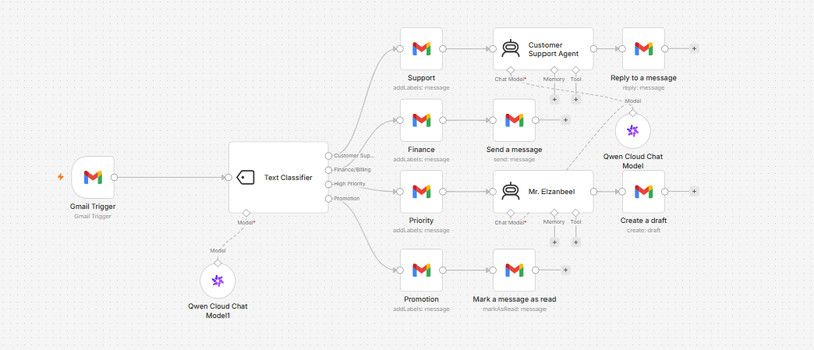

# From Zero to Inbox Agent


An AI-powered Gmail automation workflow built with n8n and Qwen Cloud that automatically classifies incoming emails, routes them to the correct workflow branch, and takes the appropriate action.

## Overview

**From Zero to Inbox Agent** transforms a Gmail inbox into an intelligent automated email processing system.

Every incoming email is analyzed by an AI-powered text classifier and assigned to one of four categories:

* Customer Support
* Finance/Billing
* High Priority
* Promotion

Based on the classification, the workflow automatically performs a different action.

## Workflow Architecture

```text
                         ┌─────────────────────┐
                         │    Gmail Trigger    │
                         └──────────┬──────────┘
                                    │
                                    ▼
                         ┌─────────────────────┐
                         │  Text Classifier    │
                         │     Qwen Cloud      │
                         └──────────┬──────────┘
                                    │
              ┌─────────────────────┼─────────────────────┐
              │                     │                     │                     │
              ▼                     ▼                     ▼                     ▼
     ┌────────────────┐    ┌────────────────┐    ┌────────────────┐    ┌────────────────┐
     │ Customer       │    │ Finance /      │    │ High Priority  │    │   Promotion    │
     │ Support        │    │ Billing        │    │                │    │                │
     └───────┬────────┘    └───────┬────────┘    └───────┬────────┘    └───────┬────────┘
             │                     │                     │                     │
             ▼                     ▼                     ▼                     ▼
     ┌────────────────┐    ┌────────────────┐    ┌────────────────┐    ┌────────────────┐
     │ Add Support    │    │ Add Finance    │    │ Add Priority   │    │ Add Promotion  │
     │ Label          │    │ Label          │    │ Label          │    │ Label          │
     └───────┬────────┘    └───────┬────────┘    └───────┬────────┘    └───────┬────────┘
             │                     │                     │                     │
             ▼                     ▼                     ▼                     ▼
     ┌────────────────┐    ┌────────────────┐    ┌────────────────┐    ┌────────────────┐
     │ AI Support     │    │ Finance Alert  │    │ Mr. Elzanbeel  │    │  Mark as Read  │
     │ Agent          │    │                │    │   AI Agent     │    │                │
     └───────┬────────┘    └────────────────┘    └───────┬────────┘    └────────────────┘
             │                                             │
             ▼                                             ▼
     ┌────────────────┐                            ┌────────────────┐
     │ Reply to Email │                            │ Create Gmail   │
     │                │                            │ Draft          │
     └────────────────┘                            └────────────────┘
```

## Features

### 1. AI Email Classification

The workflow uses Qwen Cloud to analyze the subject and body of incoming emails and classify them into four predefined categories.

### 2. Customer Support Automation

Customer support emails are automatically labeled and processed by an AI Customer Support Agent.

The agent is designed to:

* Provide concise and helpful responses
* Answer questions about AI automation, n8n, APIs, workflows, and integrations
* Avoid inventing information
* Escalate issues when human assistance is required
* Reply in the user's language whenever possible

After processing, the workflow automatically replies to the original Gmail message.

### 3. Finance & Billing Routing

Emails related to:

* Payments
* Invoices
* Refunds
* Billing
* Subscriptions
* Charges

are automatically labeled and forwarded to the configured finance email address.

### 4. High Priority Human-in-the-Loop

Urgent emails are routed to the High Priority branch.

An AI Agent called **Mr. Elzanbeel** analyzes the message and prepares a response.

Instead of sending the response automatically, the workflow creates a Gmail Draft.

This provides a **Human-in-the-Loop** safety layer for important or sensitive emails.

### 5. Promotion Management

Marketing and promotional emails are automatically labeled and marked as read.

This helps keep the inbox organized without requiring manual processing.

## AI Agents

### Customer Support Agent

The Customer Support Agent uses a professional, friendly, and concise communication style.

Its main responsibilities include:

* Customer support
* Technical guidance
* AI automation questions
* n8n workflow assistance
* API and integration guidance
* Safe escalation when necessary

### Mr. Elzanbeel

The High Priority branch uses a second AI Agent with a more direct and confident communication style.

Its response is not sent automatically:

```text
High Priority Email
        ↓
Mr. Elzanbeel AI Agent
        ↓
Generated Response
        ↓
Gmail Draft
        ↓
Human Review
```

This design reduces the risk of automatically sending inappropriate responses to critical emails.

## Technology Stack

| Technology              | Purpose                                                        |
| ----------------------- | -------------------------------------------------------------- |
| **n8n**                 | Workflow automation                                            |
| **Gmail**               | Email trigger, labeling, replies, drafts, and inbox management |
| **Qwen Cloud**          | AI language model                                              |
| **AI Agents**           | Automated email reasoning and response generation              |
| **Text Classification** | Intelligent email routing                                      |
| **Human-in-the-Loop**   | Manual review for high-priority messages                       |

## Email Classification Logic

| Category             | Example Content                            | Automated Action             |
| -------------------- | ------------------------------------------ | ---------------------------- |
| **Customer Support** | Bugs, login problems, troubleshooting      | AI response + Gmail reply    |
| **Finance/Billing**  | Payments, invoices, refunds, subscriptions | Label + finance notification |
| **High Priority**    | Urgent issues, outages, critical requests  | AI response + Gmail draft    |
| **Promotion**        | Offers, discounts, marketing emails        | Label + mark as read         |

## Project Structure

```text
From-Zero-to-Inbox-Agent/
│
├── workflow/
│   └── from-zero-to-inbox-agent.json
│
├── Screenshots/
│   └── workflow-overview.png
│
└── README.md
```

## Setup

### 1. Import the Workflow

Import `workflow/from-zero-to-inbox-agent.json` into your n8n instance.

### 2. Configure Gmail

Connect your Gmail OAuth2 credentials to the Gmail nodes.

The workflow uses Gmail for:

* Receiving emails
* Adding labels
* Sending replies
* Sending finance notifications
* Creating drafts
* Marking promotional emails as read

### 3. Configure Qwen Cloud

Connect your Qwen Cloud / Alibaba Cloud credentials to the Qwen Chat Model nodes.

The workflow uses `qwen3.7-flash` for email classification and AI agent responses.

### 4. Configure Gmail Labels

Create the following Gmail labels:

* Support
* Finance
* Priority
* Promotion

Then replace the placeholder label IDs in the imported workflow with the corresponding Gmail label IDs.

### 5. Configure Email Addresses

Replace `your-email@example.com` with the appropriate email address for your own environment.

### 6. Activate the Workflow

After configuring the credentials, labels, and email addresses, activate the workflow in n8n.

## Security

This repository contains a sanitized version of the workflow.

The following sensitive values have been replaced with placeholders:

* Gmail credential IDs
* Alibaba Cloud credential IDs
* Gmail label IDs
* Webhook IDs
* n8n instance ID
* Personal email addresses

> **Note:** Never commit real API keys, OAuth credentials, passwords, or private identifiers to a public repository.

## Use Cases

This workflow can be adapted for:

* Customer support inboxes
* SaaS support systems
* Small businesses
* AI automation communities
* Internal company email routing
* Billing and finance inboxes
* Sales and marketing inboxes
* Personal productivity systems

## Future Improvements

Possible extensions include:

* Automatic ticket creation
* CRM integration
* Slack or Microsoft Teams notifications
* Sentiment analysis
* Priority scoring
* Spam detection
* RAG-powered knowledge base
* Customer history lookup
* Multi-language support
* Human approval workflows
* Analytics and email classification dashboards

## Author

**Ahmed Gabr Elzanbeel**

AI Automation & Integration Engineer

Specializing in:

* AI Agents
* n8n Workflow Automation
* API Integrations
* Voice AI
* Email & Calendar Automation
* RAG Systems

If you find this project useful, feel free to ⭐ the repository.

